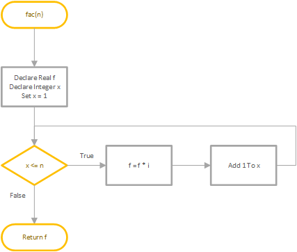
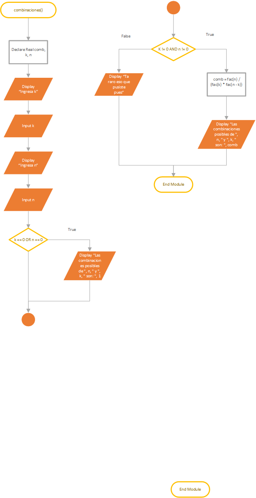
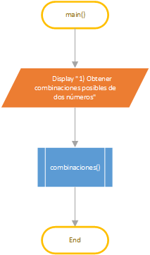

\newpage

# Diagramas de flujo

# Pseudocódigo

    Module main()
      Declare Integer option
      Display "1) Obtener combinaciones (k, n)"
      Display "2) Salir"
      Do
        Input option
        Call combinaciones()
      While option != 2
    End Module
    
    Function Real fac(Real n)
      Declare Real f
      Set f = 1
      For i = 1 To n Step 1
        f = f * i
      End For
      Return f
    End Function
    
    Module combinaciones()
      Declare Real k, n, comb
      Display "Ingresa k"
      Input k
      Display "Ingresa n"
      Input n
      If k == 0 OR n == 0 Then
        Display "Las combinaciones posibles de ", n, " y ", k, " son: ", 1
      Else
        comb = fac(n) / (fac(k) * fac(n - k))
        Display "Las combinaciones posibles de ", n, " y ", k, " son: ", comb
      End If
    End Module