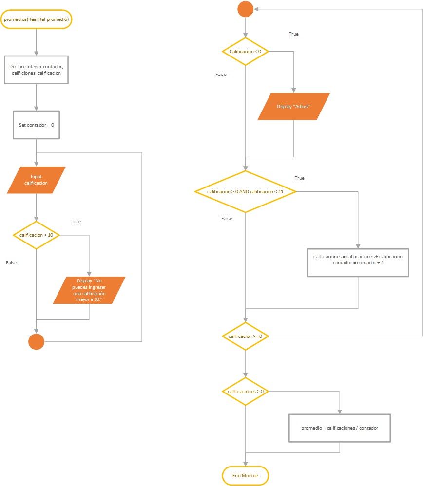
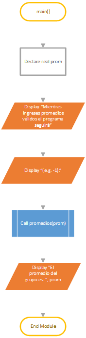

\newpage

# Diagramas de flujo

## Módulo: promedios

## Main

# Pseudocódigo

		Module main()
			// Declaro una variable para el promedio del grupo
			Declare Real prom

			// Muestro un mensaje de introducción
			Display "Mientras ingreses promedios válidos el programa seguirá"
			Display "(e.g. -1)."

			// Obtengo el promedio del grupo
			Call promedios(prom)
			Display "El promedio del grupo es: ", prom
		End Module

		Module promedios(Real Ref promedio) 
			// Variables necesarias para sacar el promedio.
			Declare Integer contador, calificaciones, calificacion

			// Inicializo el contador.
			Set contador = 0
			
			// Es necesario un Do-While para poder recibir input.
			Do
				Input calificacion

				// Me aseguro que la calificación no sea mayor a 10.
				If calificacion > 10 Then
					Display "No puedes ingresar una calificación mayor a 10."
				End If

				// Me aseguro que la calificación no sea menor a 0.
				If calificacion < 0 Then 
					Display "Adios!"
				End If 

				If calificacion > 0 AND calificacion < 11 Then
					calificaciones = calificaciones + calificacion
					contador = contador + 1
				End If

			While calificacion >= 0

			// Me aseguro que la suma total de calificaciones no sea menor a 0, ya que si se realiza una división con 0 es error.
			If calificaciones > 0 Then
				promedio = calificaciones / contador
			End If
		End Module
