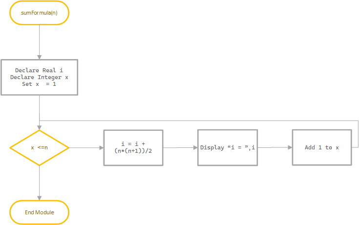
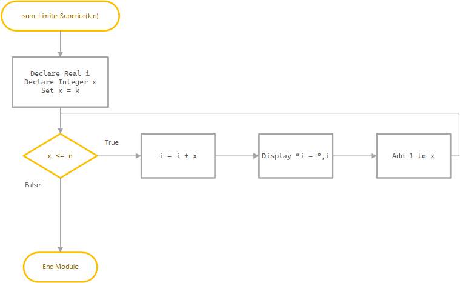
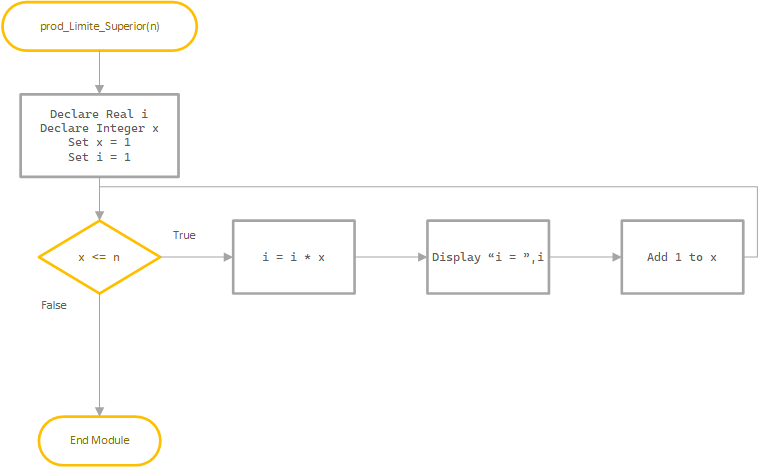
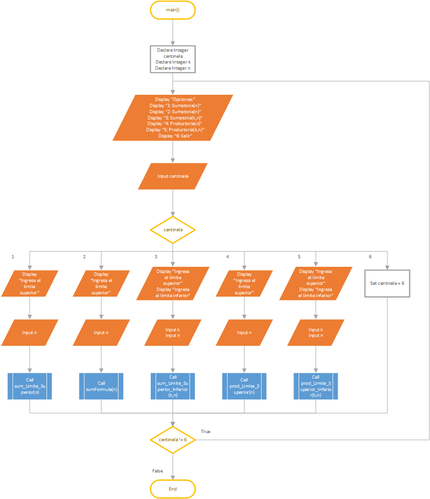

\newpage
 
# Planteamiento 

Mediante el uso de módulos y una estructura case, se creará un menú que acepte input del usuario y dependiendo de que haya ingresado se llamará a un módulo. 

Nombres de los módulos:

+ Sumatoria con límite superior: **sum_Limite_Superior**

+ Sumatoria con fórmula: **sumFormula**

+ Sumatoria con límite inferior y superior: **sum_Limite_Superior_Inferior**

+ Productoria con límite superior: **prod_Limite_Superior**

+ Productoria con límite inferior y superior: **prod_Limite_Superior_Inferior**
 
## Diagrama de flujo

### Sumatoria con límite superior

### Sumatoria con fórmula

### Sumatoria con límite inferior y superior

### Productoria con límite superior

### Productoria con límite inferior y superior

### Main

# Pseudocódigo

    Module main()
        Declare Integer k, n, option
        Do 
        Display "Opciones:"
        Display "1: Sumatoria(n)"
        Display "2: Sumatoria(n)"
        Display "3: Sumatoria(k,n)"
        Display "4: Productoria(n)"
        Display "5: Productoria(k,n)"
        Display "Salir"
        Input option
        Select option
            Case 1:
                Display "Ingresa n"
                Input n
                Call sum_Limite_Superior(n)
            Case 2:
                Display "Ingresa n"
                Input n
                Display "Ingresa la fórmula"
                Input f
                Call sumFormula(n)
            Case 3:
                Display "Ingresa k"
                Input k
                Display "Ingresa n"
                Input n
                Call sum_Limite_Superior_Inferior(k,n)
            Case 4:
                Display "Ingresa n"
                Input n               
                Call prod_Limite_Superior(n)
            Case 5:
                Display "Ingresa k"
                Input k
                Display "Ingresa n"
                Input n
                Call prod_Limite_Superior(k,n)
            Case 6:
            	Display "Adios!"
            	Set option = 6
        While option != 6
    End Module
    
    Module sum_Limite_Superior(Real n)
        Declare Real i
        For x = 1 To n Step 1
            i = i + x
        End For
        Display "i = ", i
    End Module
    
    Module sumFormula(Real n)
        Declare Integer i
        For x = 1 To n Step 1
            i = i + (n*(n+1))/2
        End For
        Display "i = ", i
    End Module       
    
    Module sum_Limite_Superior_Inferior(Real k,n)
        Declare Real i 
        For x = k To n Step 1
            i = i + k
        End For
        Display "i = ", i
    End Module          
    
    Module prod_Limite_Superior(Real n)
        Declare Real i
        Set i = 1 
        For x = 1 To n Step 1
            i = i * x
        End For
        Display "i = ", i
    End Module                 
    
    Module prod_Limite_Superior_Inferior(Real k,n)
        Declare Real i
        Set i = 1
        For x = k To n Step 1
            i = i * x
        End For
        Display "i = ", i
    End Module
